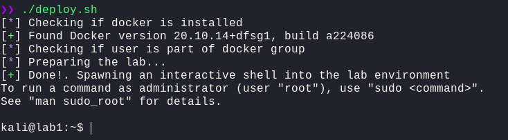
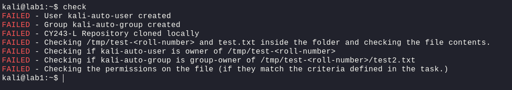
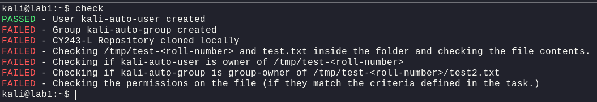

# Deployment

---

All the automation scripts and setup files will be pasted in this directory as the course progresses.

This folder is meant to make it easier for Lab Engineers to deploy their Lab Environments without actually having to worry about setting up robust VMs and everything.
However, the pre-requisite to understand the deployment and modification phase is the know-how of the following technologies

- Docker and Docker-Compose
- Vagrant
- Ansible
- Bash

If the instructor has the knowledge about these technologies then modifying each lab according to the students will be a piece of cake.

---

For quizzes, I'll make use of CTFd to host quiz; either locally or remotely and then each quizes' data can easily be exported into a .csv format and can easily be graded. I also will be making a script to automate this task, those scripts will be placed in the `/scripts` directory.

---

## Deployment

For most of the labs, you will be provided with a simple `deploy.sh`. You will need to have `docker` installed on your system to deploy each lab successfully. Each provided lab will have an isolated environment for you to practice in. You can simply type `exit` to leave the provided lab environment.

> NOTE: Instructors, you will simply let each student deploy the lab environment, let them perform their tasks and once done; they can take a screenshot of task completion and if you're with them; show it to you as well.

## Lab - 1

In Lab-1, the Tasks have been defined in the [Tasks](../Tasks) directory. Each task has a `README.md` file which contains the instructions for the task.
Another useful command has been added called `check`, which will verify your status; how much you've done (successfully) and how much remains to be done.

Upon successful completion of a task (let's say adding a new user), once that's done, you'll need to run `check` again to verify your progress

---
