# Lab 1 - Introduction to Linux and Bash

---

## What is Linux?

Linux is an open-source operating system kernel that serves as the foundation for various operating systems, commonly referred to as "Linux distributions" or "Linux distros." These distributions combine the Linux kernel with a collection of software packages, libraries, utilities, and a user interface to create a complete and functional operating system.

Here are the top 5 most commonly used Linux distributions for general use:

- **Ubuntu**: Known for its user-friendly interface and strong community support, Ubuntu is one of the most popular Linux distributions. It offers regular releases and long-term support versions suitable for both desktop and server environments.
- **Linux Mint**: Built on top of Ubuntu, Linux Mint focuses on providing a user-friendly and familiar experience, often incorporating user interface elements similar to those found in traditional operating systems like Windows.
- **Debian**: Debian is known for its stability and focus on free and open-source software. It serves as the basis for many other distributions and offers multiple releases, including the stable, testing, and unstable branches.
- **Fedora**: Sponsored by Red Hat, Fedora aims to showcase the latest open-source technologies while maintaining a balance between cutting-edge features and stability. It serves as a testing ground for innovations that might later appear in Red Hat Enterprise Linux.
- **CentOS (now CentOS Stream)**: Historically, CentOS provided a free, community-supported version of Red Hat Enterprise Linux (RHEL). However, as of late 2020, CentOS Stream has become the upstream development branch for RHEL, and its role has shifted.

Now, for the hacking-focused distributions, these are not inherently used for malicious purposes, but rather for ethical hacking, penetration testing, and security research:

1. **Kali Linux**: Perhaps the most well-known ethical hacking distribution, Kali Linux is tailored for penetration testing and security assessments. It includes a vast array of tools for various security testing purposes.
2. **Parrot Security OS**: Similar to Kali Linux, Parrot Security OS is designed for security researchers and ethical hackers. It provides a comprehensive suite of tools for various security tasks.
3. **BlackArch Linux**: BlackArch is a penetration testing distribution that specializes in providing a large repository of tools for security professionals. It's built on top of Arch Linux.
4. **BackBox**: BackBox is a relatively lightweight distribution that focuses on penetration testing, vulnerability assessment, and forensic analysis. It's designed to be fast and easy to use.
5. **Pentoo**: Pentoo is a Gentoo-based Linux distribution with a strong emphasis on penetration testing and security assessment. It's optimized for system and network auditing.

## What is a Shell?

A **shell** is a command-line interface (CLI) program that provides a way for users to interact with an operating system (OS). It acts as an intermediary between the user and the OS, allowing users to execute various commands and programs by typing text-based instructions. Shells interpret the commands entered by the user, interact with the OS to execute those commands, and display the results.

## What is a Terminal?

A **terminal** is a software application that provides an interface for users to interact with a shell. It's essentially a window into which you can type commands and receive their output. Terminals allow you to enter text-based commands, and the terminal then communicates with the shell to execute those commands. The shell processes the commands and returns the output to the terminal, which displays it for the user.

## Difference between a shell and a Terminal

In many cases, people use the terms "shell" and "terminal" interchangeably because they often work together to provide a command-line environment. Common shells include Bash, Zsh, and PowerShell, while terminals can be various software applications like GNOME Terminal, Kitty, Konsole, macOS Terminal, or Windows Terminal.

## Installation of Kali Linux

Before moving towards the installation of Kali, we need to firstly decide on a Hypervisor.

> A hypervisor, often referred to as a Virtual Machine Monitor (VMM), is a software or hardware component that enables virtualization

Most common `Hosted` Hypervisors are

1. VMware Workstation (Player/Pro)
2. Virtualbox

For this course, we’ll utilize `Virtualbox` as it is Open-source and can easily be setup.

> **NOTE:** For those of you that use Laptops, please ensure that `VT-X/AMD-V (Commonly known as Virtualization)` is enabled from BIOS settings. Otherwise, you cannot run Virtual Machines on your system.

### Installing Virtualbox

- Download Virtualbox from [here](https://www.virtualbox.org/wiki/Downloads)

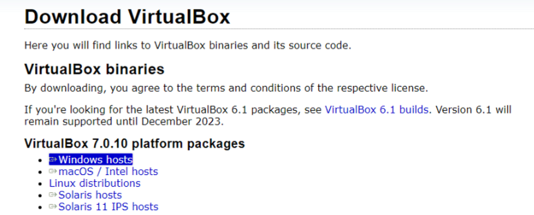

- Install Virtualbox

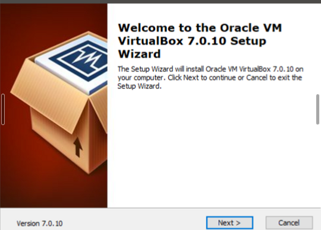
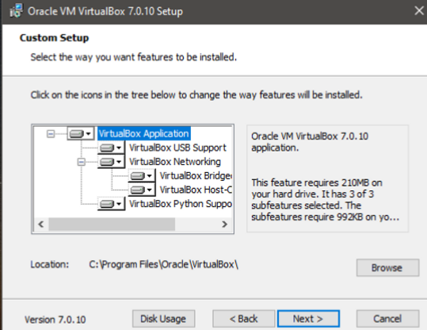
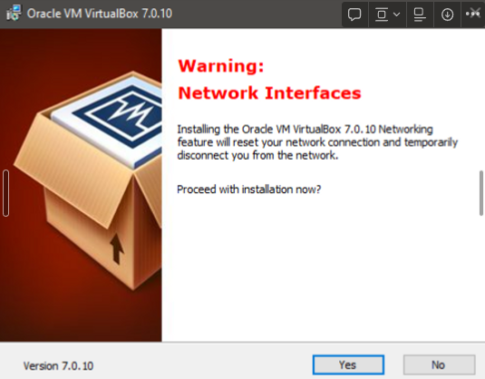

In case dependencies are missing, Virtualbox will *most probably* install those itself

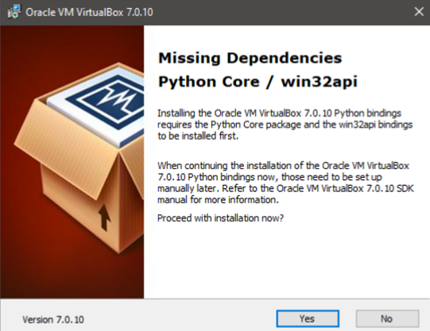
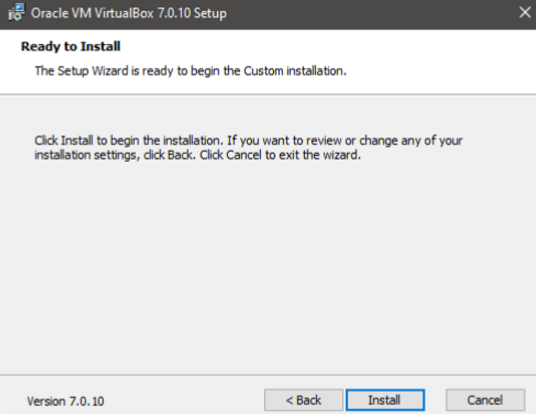
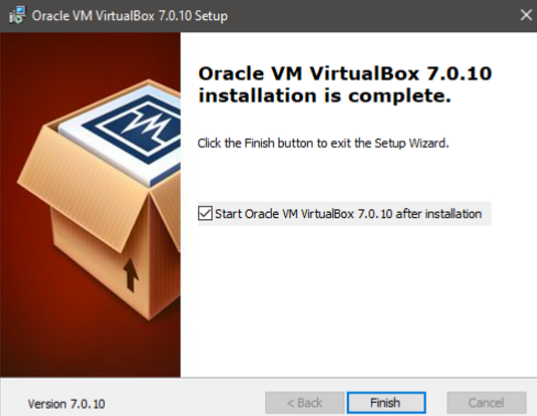

- Once installed, open Virtualbox and you'll be greeted with the following screen.
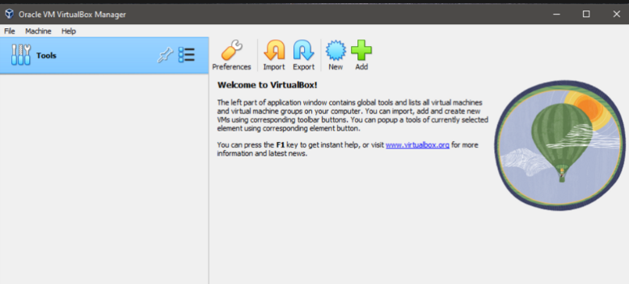

### Kali Linux

Now, Kali Linux can be installed in two different ways

1. Using the Pre-built VirtualBox image
2. Using the `iso` file and installing ourselves

We will be using the Virtualbox image. To use that, we will visit [kali.org](https://www.kali.org/get-kali/#kali-virtual-machines)

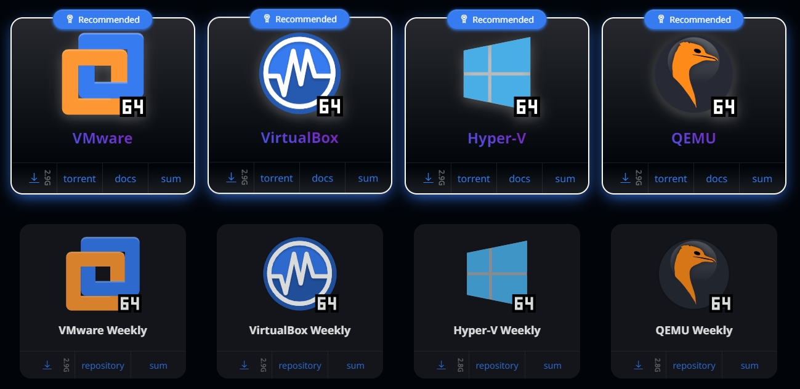

Here, we will download the image for our Hypervisor (Virtualbox in our case.)

Once downloaded, we'll get the following file

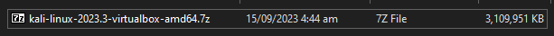

Upon extraction of this file, we get the following

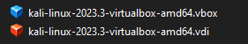

We will click on the `.vbox` file and it will be imported inside Virtualbox

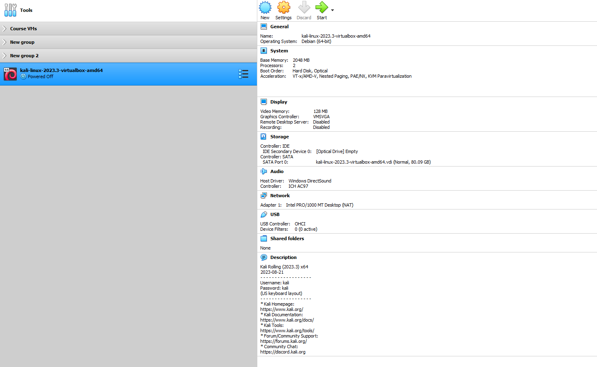

Now, will simply click on start and Kali will boot up

> The default credentials are `kali:kali`

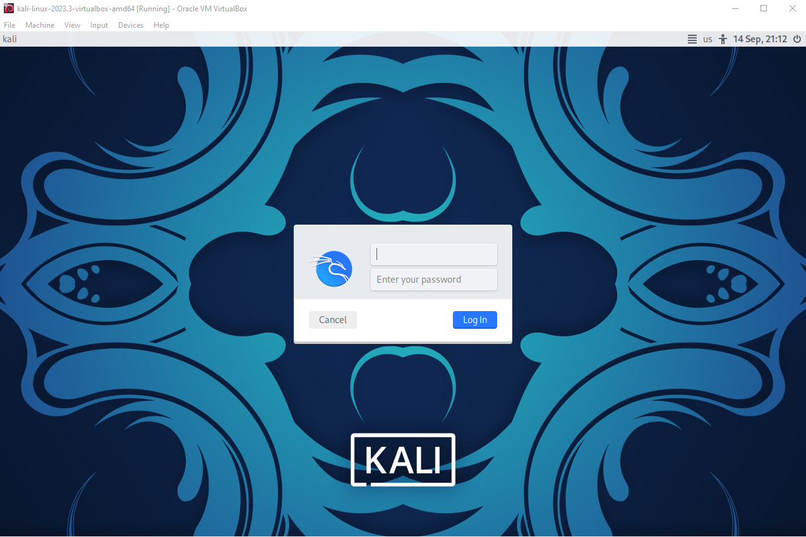

Once Kali boots up, we will be greeted with the following screen

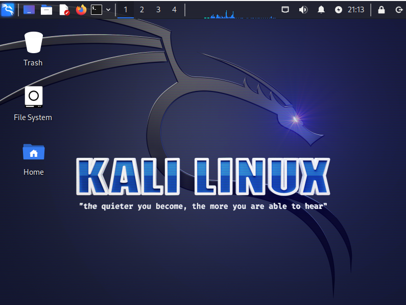

This Kali desktop is often referred to as `XFCE` desktop. It is a lightweight desktop environment that is used in Kali Linux.

---

## Linux Filesystem Hierarchy

The Linux filesystem hierarchy is the structure of directories that is used in Linux and other Unix-like operating systems. It resembles a tree-like structure, with directories branching off from the root directory, which is represented by a forward slash (`/`). Each directory can contain files and other directories, which can contain additional files and directories, and so on.

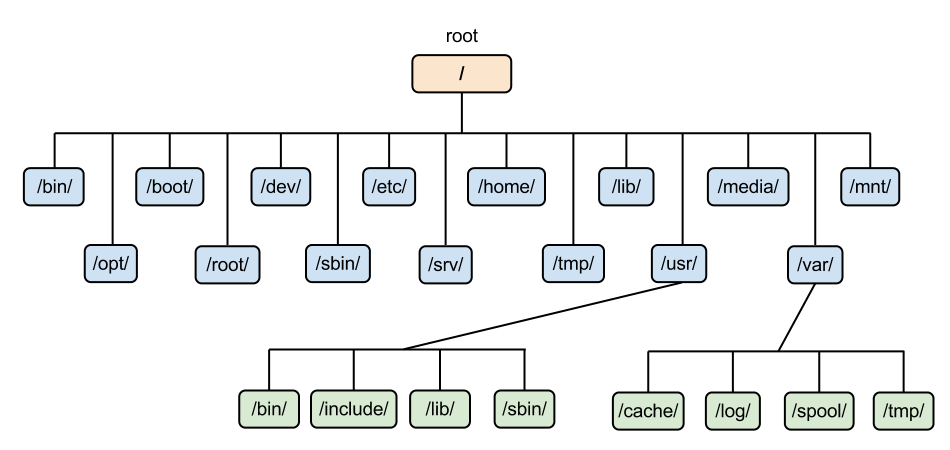

```text
/ - The root directory, which contains all other directories and files on the system and serves as the base of the filesystem hierarchy.
├── bin - Contains essential command-line utilities and programs that are required for the system to function properly.
|   ├── bash - The Bash shell.
├── boot - Contains the files required for booting the system, such as the Linux kernel and the bootloader configuration.
├── dev - Contains device files that represent hardware devices connected to the system.
├── etc - Contains system-wide configuration files.
├── home - Contains the home directories for regular users.
|   ├── /<username> - The home directory for the <username> user.
├── lib - Contains shared libraries that are required by the essential binaries in the /bin and /sbin directories.
├── media - Contains mount points for removable media, such as USB flash drives and CD-ROMs.
├── mnt - Contains mount points for temporarily mounted filesystems.
├── opt - Contains optional software packages that are not installed by default.
├── proc - Contains virtual files that represent system and process information.
├── root - The home directory for the root user.
├── run - Contains runtime data for system services.
├── sbin - Contains essential system binaries that are required for the system to function properly.
├── srv - Contains data for services provided by the system.
├── sys - Contains virtual files that represent system information.
├── tmp - Contains temporary files.
├── usr - Contains user utilities and applications.
|   ├── /bin - Contains non-essential command-line utilities and programs.
|   ├── /lib - Contains shared libraries that are required by the binaries in the /bin directory.
|   |-- /include - Contains header files that are required for compiling C programs.
|   ├── /local - Contains software packages that are installed locally.
|   ├── /sbin - Contains non-essential system binaries.
|   ├── /share - Contains shared data used by applications.
|   ├── /src - Contains source code.
|── var - Contains variable data, such as logs, databases, and websites.
|   |-- /log - Contains log files.
|   |-- /www - Contains websites.
```

---

## Linux Basic Commands

### `whoami`

`whoami` prints the current user.

```bash
whoami
```

### `pwd`

`pwd` stands for `Print Working Directory`. It prints the current working directory.

```bash
pwd
```

### `ls`

`ls` stands for `List`. It lists the contents of the current directory.

```bash
ls
# NOTE: ls command has several different flags that can be used to modify its output
```

### `cd`

`cd` stands for `Change Directory`. It changes the current working directory.

```bash
cd <directory>
```

### `mkdir`

`mkdir` stands for `Make Directory`. It creates a new directory.

```bash
mkdir <directory>
```

### `touch`

`touch` creates a new file.

```bash
touch <file>
```

### `rm`

`rm` stands for `Remove`. It removes a file or directory.

```bash
rm <file>
## To remove a folder:
rm -rf <folder>
```

### `mv`

`mv` stands for `Move`. It moves a file or directory, can also be used to rename a file or directory.

```bash
mv <source> <destination>
```

### `cp`

`cp` stands for `Copy`. It copies a file or directory.

```bash
cp <source> <destination>
```

### `cat`

`cat` stands for `Concatenate`. It prints the contents of a file to the terminal.

```bash
cat <file>
```

### `echo`

`echo` prints text to the terminal.

```bash
echo <text>
```

### `man`

`man` stands for manual. It can be used to display the manual pages about a specific command.

```bash
man <command-name>
```

### `clear`

`clear` clears the terminal screen.

```bash
clear
```

### `exit`

`exit` exits the current shell.

```bash
exit
```

### `sudo`

`sudo` stands for `Super User Do`. It allows you to run commands with elevated privileges. Similar to `Run as Administrator` in Windows.

```bash
sudo <command>
```

### `su`

`su` stands for `Switch User`. It allows you to switch to another user account.

```bash
su <username>
```

### `passwd`

`passwd` allows you to change your password.

```bash
passwd
```

### `chmod`

`chmod` stands for `Change Mode`. It allows you to change the permissions of a file or directory.

```bash
chmod <permissions> <file>
```

### `chown`

`chown` stands for `Change Owner`. It allows you to change the owner of a file or directory.

```bash
chown <owner> <file>
```

### `useradd`

`useradd` allows you to create a new user account.

```bash
useradd <username>
```

### `userdel`

`userdel` allows you to delete a user account.

```bash
userdel <username>
```

### `groupadd`

`groupadd` allows you to create a new group.

```bash
groupadd <groupname>
```

### `groupdel`

`groupdel` allows you to delete a group.

```bash
groupdel <groupname>
```

### `apt`

`apt` stands for `Advanced Packaging Tool`. It is a package manager for Debian-based Linux distributions.

```bash
# In order to install a software
sudo apt install <package-name>

# In order to update the package list
sudo apt update
```

### `wget`

`wget` stands for `Web Get`. It is a command-line utility for downloading files from the internet.

```bash
wget <url>
```

### `curl`

`curl` stands for `Client URL`. It is a command-line utility for transferring data to or from a server.

```bash
# In order to download a file
curl -O <url>
```

### `git`

`git` is a version control system for tracking changes in source code during software development.

```bash
# In order to clone a repository
git clone <url>
```

### `history`

`history` displays the history of commands that have been executed in the current shell.

```bash
history
```

---

## Class Task - 1

1. List all files inside the `/usr/share` directory
2. Create a new user called `test`
3. Create a new group called `testgrp`
4. Add the `test` user to the `testgrp` group
5. Create 2 new files called `test1.txt` and `test2.txt` inside the `/home/kali` directory and them delete them.

---
