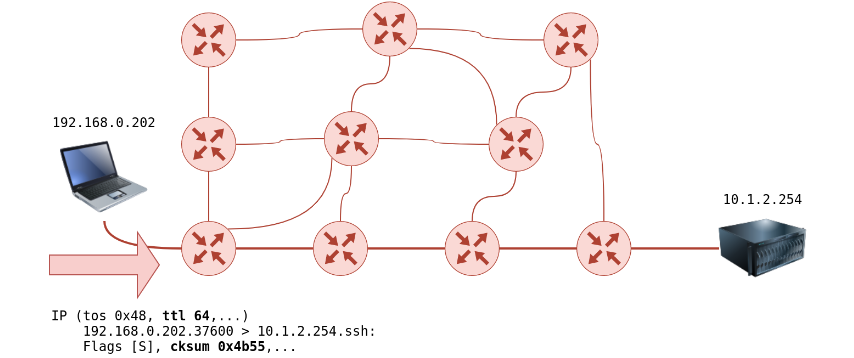

# Lab 3 - Recon and Enumeration

## *Passive Recon:*

Passive reconnaissance, also known as passive recon, is a preliminary phase of information gathering in cybersecurity. During this phase, an individual or a team collects data and information about a target system or network without directly interacting with it. The goal is to gather as much publicly available information as possible, such as domain names, IP addresses, email addresses, and other relevant details. Passive recon techniques include conducting WHOIS searches, using search engines like Google for gathering information through Google Dorking, and analyzing publicly available network records. This information can then be used to gain insights into potential vulnerabilities or weaknesses in the target system or network, helping in the subsequent phases of the security assessment.

Passive reconnaissance activities include many activities, for instance:

- Looking up DNS records of a domain from a public DNS server.
- Checking job ads related to the target website.
- Reading news articles about the target company.

### *WHOIS:*

WHOIS is a query and response protocol used for querying databases that store the registered users or assignees of an Internet resource, such as a domain name, IP address block, or an autonomous system. It provides information about the registered domain name, domain registrar, domain owner's contact details, and other related information.

**Syntax for WHOIS command:**

To perform a WHOIS lookup, you can use the following command:

```
whois <domain-name>
```

Replace `<domain-name>` with the actual domain name you want to look up.

**Sample Output:**

```
Domain Name: EXAMPLE.COM
Registry Domain ID: 123456789_DOMAIN_COM-VRSN
Registrar WHOIS Server: whois.example.com
Registrar URL: <http://www.example.com>
Updated Date: 2022-01-01T00:00:00Z
Creation Date: 2010-01-01T00:00:00Z
Registry Expiry Date: 2023-01-01T00:00:00Z
Registrar: Example Registrar, Inc.
Registrar IANA ID: 1234
Registrar Abuse Contact Email: abuse@example.com
Registrar Abuse Contact Phone: +1.5555555555
Domain Status: clientTransferProhibited <https://icann.org/epp#clientTransferProhibited>
Name Server: ns1.example.com
Name Server: ns2.example.com
DNSSEC: unsigned
URL of the ICANN Whois Inaccuracy Complaint Form: <https://www.icann.org/wicf/>
>>> Last update of whois database: 2022-01-01T00:00:00Z <<<

For more information on WHOIS lookup, you can refer to the [ICANN WHOIS FAQ](<https://www.icann.org/resources/pages/faqs-2017-10-10-en>).

```

Please note that the above output is just a sample, and the actual output may vary depending on the domain name and registrar.

### *DIG:*

The `dig` command is a powerful tool used for querying DNS (Domain Name System) servers. It is commonly used to obtain information about DNS records, such as IP addresses, MX (Mail Exchange) records, and more.

### DNS Servers

DNS servers are a fundamental part of the internet infrastructure. They translate human-readable domain names, like `example.com`, into IP addresses, which computers use to communicate with each other. DNS servers store and manage these domain-to-IP mappings, allowing users to access websites and services using domain names.

### *Syntax for Normal DIG Command*

To perform a normal `dig` command, you can use the following syntax:

```bash
dig <domain-name>
```

Replace `<domain-name>` with the actual domain name you want to query.

### *Syntax for DIG Command with Custom DNS Server*

To specify a custom DNS server for the `dig` command, you can use the following syntax:

```bash
dig <domain-name> @<custom-dns-server>
```

Replace `<domain-name>` with the actual domain name you want to query, and `<custom-dns-server>` with the IP address or hostname of the custom DNS server.

### *Shodan*

Shodan is a search engine specifically designed for internet-connected devices and systems. It allows users to search for specific types of devices, such as webcams, routers, servers, and even industrial control systems, based on various search criteria. Shodan scans and indexes devices and systems on the internet, collecting information such as IP addresses, open ports, banners, and other details.

Shodan is particularly useful in passive reconnaissance because it provides insights into the devices and systems that are publicly accessible on the internet. By searching Shodan, cybersecurity professionals can identify potential targets for further investigation and vulnerability assessment. They can gather information about open ports, services running on those ports, and even specific vulnerabilities associated with those services. This can help in identifying potential security weaknesses and understanding the overall security posture of a target system or network.

The information obtained from Shodan can be used to gain insights into potential attack vectors, identify misconfigurations, and prioritize security assessments. It is an invaluable tool for cybersecurity professionals during the passive reconnaissance phase as it provides a wealth of information about internet-facing systems and devices, enabling them to make informed decisions regarding further investigation and assessment.

⇒ Utilizing University Email Address with Shodan.io:

Shodan recently announced the ***academic*** package for students that have `.edu` domains. Which means that you’re eligible. 

> Go to [https://shodan.io](https://shodan.io) and sign up using your university and claim the academic package learn to find vulnerable servers.
> 

> **NOTE:** DO NOT ATTACK anyone without their consent.
> 

### *Google Dorking:*

Google Dorking is a technique used to find specific information on the internet using advanced search operators in Google search. By combining these operators, users can narrow down their search queries and find specific types of information that may not be easily accessible through conventional search methods.

Here are some examples of Google Dorks that can be used to find vulnerable servers:

- `intitle:"Index of" "Apache/2.2.15 (CentOS) Server at"` - This dork helps find Apache servers running on CentOS with an index page that lists files and directories.
- `inurl:/cgi-bin/ filetype:sh` - This dork is used to find CGI scripts that may be vulnerable.
- `intitle:"index of" "config.yaml"` - This dork searches for exposed configuration files that may contain sensitive information.
- `intext:"Powered by phpMyAdmin" intitle:"phpMyAdmin" intext:"Welcome to phpMyAdmin"` - This dork is used to find instances of phpMyAdmin, a popular database management tool, that may be misconfigured or outdated.

Please note that using Google Dorks to find vulnerable servers should only be done for ethical purposes and with the necessary permissions. It is important to adhere to ethical guidelines and respect the privacy and security of others.

Remember, the goal is to identify potential vulnerabilities and help improve security, not to exploit or harm systems without consent.

## Active Recon:

### Active Recon:

Active reconnaissance is a phase of information gathering in cybersecurity where an individual or a team interacts directly with a target system or network to gather information. Unlike passive reconnaissance, active recon involves sending requests or probes and analyzing the responses to gain insights into the target's security posture and potential vulnerabilities.

Examples of active reconnaissance activities include:

- Connecting to one of the company servers such as HTTP, FTP, and SMTP.
- Calling the company in an attempt to get information (social engineering).
- Entering company premises pretending to be a repairman.

### Ping

Ping is a network utility used to test the reachability of a host on an Internet Protocol (IP) network. It sends ICMP Echo Request messages to the target host and waits for ICMP Echo Reply messages in response. The ping command is commonly used to check if a host is online, measure round-trip time (RTT), and identify network connectivity issues. The basic usage of the ping command is `ping -c1 <target-host>`.

### Traceroute

Traceroute (also known as tracert) is a network diagnostic tool used to trace the path that packets take from a source host to a destination host. It shows the IP addresses and the time it takes for packets to reach each intermediate hop along the route. Traceroute helps identify network bottlenecks, packet loss, and routing issues. The traceroute command is typically used as `traceroute <target-host>`.



### Nmap

Nmap (Network Mapper) is a powerful and versatile network scanning tool used for network exploration and security auditing. It can discover hosts, services, and open ports on a network, providing valuable information about the target. Nmap supports various scanning techniques, such as TCP SYN scan, UDP scan, and OS fingerprinting. It is commonly used by security professionals to assess network security. The basic usage of Nmap is `nmap <target>`.

The most famous nmap flags are:

- `A`: Enables OS detection, version detection, script scanning, and traceroute.
- `sS`: Performs a TCP SYN scan, which is the default scan type and usually the fastest scan option.
- `sC`: Enables the default script scan, which runs a set of scripts defined in the NSE (Nmap Scripting Engine).
- `sV`: Enables version detection, which attempts to determine the version of the services running on the target ports.
- `oN`: Saves the output in normal format to a specified file.
- `oG`: Saves the output in grepable format to a specified file.
- `p`: Specifies the port(s) or port range(s) to be scanned.
- `Pn`: Treats all hosts as online, skipping host discovery.
- `sn`: Performs a ping scan to determine which hosts are online.

These flags are commonly used in network scanning and reconnaissance to gather information about target systems.

We can use multiple flags in coordination with each other. For example:

1. Let’s suppose, we just want to check whether the hosts in a subnet are up and store their output in a `grepable` format:
    
    ```bash
    nmap -sn -oG output.log 10.0.0.0/24
    ```
    
2. If we already know the open ports, and we want to perform version and service scan:
    
    ```bash
    nmap -p 22,80 -sC -sV -oN output.txt 10.15.12.52
    ```
    

### Rustscan

Rustscan is a fast and lightweight port scanner written in Rust. It is designed to quickly scan a target host or network for open ports and services. Rustscan provides detailed information about open ports, including the service running on each port. It is known for its speed and simplicity. The basic usage of Rustscan is `rustscan -a <target>`.

Rustscan also supports the running of nmap scripts which makes it very powerful.

```bash
rustscan -a <target> -- <nmap commands>
## Example:
rustscan -a <target> -- -sC -sV -oN output.log
```

### Nikto

Nikto is a web server vulnerability scanner that targets web servers and identifies potential security issues. It checks for outdated versions of web server software, misconfigurations, and common web application vulnerabilities. Nikto can scan websites and web servers for known vulnerabilities, providing valuable insights for security assessment.
The basic usage of Nikto is `nikto -h <target>`.

### Gobuster/dirbuster/dirb

Gobuster is a tool used for directory and file enumeration on web servers. It helps discover hidden directories, files, and subdomains by brute-forcing their names. Gobuster can be useful for identifying sensitive files, misconfigurations, and potential entry points for further assessment.
In order to use gobuster, run the following command:
```bash
dir -u <target-url> -w <wordlist>
```

> Not only for bruteforcing directories, but gobuster can also be used to identify subdomains, vhosts etc.

### Ffuf

Ffuf is a fast web fuzzer used for discovering hidden files and directories on web servers. It can be used to identify files and directories that are not linked within the website but are still accessible. Ffuf helps in discovering sensitive information, misconfigurations, and potential security vulnerabilities.
The basic usage of Ffuf is:
```bash
ffuf -w <wordlist> -u <target-url>/FUZZ
```

### Enum4linux

Enum4linux is a tool used for enumerating information from Windows and Samba systems. It gathers data such as user and group names, shares, policies, and other details from Windows-based systems. Enum4linux can be helpful in identifying potential security weaknesses and gathering valuable information during security assessments.
Usage:
```
enum4linux <target>
```
> NOTE: For most tools, you can type `tool-name --help` to bring out their help menu.

### Searchsploit

Searchsploit is a command-line tool used to search for exploits and vulnerabilities in various exploit databases, including Exploit-DB. It helps security professionals identify publicly available exploits and vulnerabilities associated with specific software versions. Searchsploit can be used to gather information about potential vulnerabilities and assist in security assessments.
The basic usage of Searchsploit is `searchsploit <search-term>`.

Once you've found the exploit you're looking for, copy the `path` and type `searchsploit -m <path>`.
#### Example
Let's suppose you're looking for an exploit for `joomla`
```bash
searchsploit joomla
```
The output is something like this:

| Exploit title | Path |
| ---- | ---- |
| Joomla! Plugin tinybrowser 1.5.12 - Arbitrary File Upload / Execution | php/webapps/9926.rb |
| Joomla! Core 1.5.0 - 3.9.4 - Directory Traversal / Authenticated Arbitrary File Deletion | php/webapps/46710.py |

Now, let's say, we're dealing with `Joomla Core 1.5.0`, we can use the second exploit in the table, in order to make a copy (`mirror`) the exploit, we can use the following command:
```bash
searchsploit -m php/webapps/46710.py
```
This will make a copy the exploit in the local directory and we can simply run it like:
```bash
python3 46710.py
## Whatever that last string might be.
```

> **NOTE:** Active Reconnaissance should be performed ethically and with proper authorization. It is important to obtain the necessary permissions before conducting any security assessments on target systems or networks.

---
